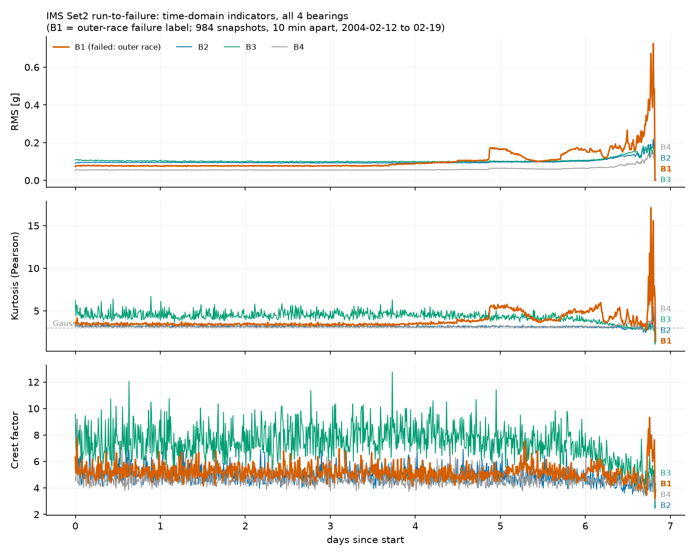

# C1 — 時間領域指標: RMS・尖度・波高率

対象コード: `src/lib/indicators.py` / 照合: `src/c1_compare.py` / トレンド: `src/c1_trend.py`

## 1. 何を解くか

Set2 は 984 スナップショット × 4ch × 20,480 点。全波形は読めないので、各1秒波形を
少数のスカラーへ圧縮し、**指標の時系列**として劣化を追う。C1 の問いは「この圧縮は
何を捨てて何を残すか」。

## 2. 定義(宣言済み規約)と数式

3指標とも**平均除去後**(AC成分)に定義する。センサDCオフセットを振動と混ぜないため。

### RMS — エネルギー

$$
\mathrm{rms}(x) = \sqrt{\frac{1}{N}\sum_{i=1}^{N}(x_i - \bar{x})^2} = \sqrt{m_2}
$$

全サンプルが対等に効く。まれな衝撃(1秒中数ms)はNで薄められるため鈍い。
平均除去後の定義なので**母集団標準偏差と厳密に同じ量**になる( `np.std` と rel=0 で一致)。

### 尖度 — 衝撃性(裾の重さ)

$$
\mathrm{kurt}(x) = \frac{m_4}{m_2^{\,2}}, \qquad m_k = \frac{1}{N}\sum_{i=1}^{N}(x_i - \bar{x})^k
$$

規約: **Pearson 流(ガウス = 3、−3 しない)、1/N(バイアス補正なし)**。
4乗の意味: $2\sigma$ の点は $m_2$ に4倍で効くが $m_4$ には**16倍**で効く。
「たまに来る大振幅」の検出器。10σスパイク1本(N=20,480)で RMS +0.24% / 尖度 +16% /
波高率 2倍超 — 希釈が効くか1点が直撃するかの違い。

### 波高率 — ピーク性

$$
\mathrm{cf}(x) = \frac{\max_i \lvert x_i - \bar{x} \rvert}{\mathrm{rms}(x)}
$$

分子が最大値1点で決まるため感度最大・頑健性最小。

## 3. ライブラリ照合(乖離の3スケール分離)

3指標 × 3信号(合成ガウス / CWRU 正常 / IMS Set2 先頭)で:

| 照合 | 結果 |
|---|---|
| rms ↔ `np.std` | rel = 0(厳密一致) |
| kurtosis ↔ `scipy.stats.kurtosis(fisher=False, bias=True)` | rel = 0(厳密一致) |
| kurtosis ↔ scipy **既定値** | 3信号とも差が**厳密に 3.000**(Fisher流=過剰尖度) |
| kurtosis ↔ `bias=False` | rel ≈ 1e-4 ≈ $c/N$( $c \approx 2$ ) |

**一般知見**: 乖離は3スケールに分離する — 定義差 $O(1)$ / 補正差 $O(1/N) \sim 10^{-4}$ /
浮動小数点丸め $\sim 10^{-16}$。照合閾値(rtol=1e-12)は「小さく」ではなく
**分離したい2スケールの空隙に**置く。定数オフセット(厳密に3)は定義差の指紋、
ランダムな大きさなら数値差。

## 4. Set2 全期間トレンドと立ち上がりの実測

固定: 指標定義・全984ファイル・全4ch。変化: 時間のみ。

**立ち上がり規則(宣言)**: ベースライン 0〜3日、平均 +5σ、3点連続超過の最初。

| ch | RMS | 尖度 | 波高率 |
|---|---|---|---|
| **B1(外輪故障)** | **3.70日** | 4.79日 | 超えず |
| B2 | 5.81日 | なし | — |
| B3 | 6.25日 | なし | — |
| B4 | 4.86日 | 6.49日 | — |

### 観測と判定

1. **教科書ストーリー「尖度が先・RMSが後」は本データで順序が逆**。予測(「綺麗には
   現れない」)は的中したが、想定した機構(初日から衝撃的で尖度が鈍る)とは別の形。
   RMS が先行した一因はベースラインの静けさ(CV 1.4% → +5σ でも +0.7% の変化で発報)。
   **指標の感度は物理だけでなくベースライン変動で決まる。** 対して B3 の尖度は
   CV 10.4% と暴れており、同じ +5σ が実効的に大きな閾値になる。
2. **RMS 先行の物理仮説(未検証)**: 潤滑膜切れ→摩擦増大が、離散衝撃の形成前に
   広帯域エネルギーを押し上げた。C2 のスペクトルで「広帯域か離散線か」を見て部分検証。
3. **B3 は全期間で最も衝撃的(尖度 4〜6・CF 7〜10)だが壊れていない**。
   「尖度・CFが高い=異常」の単純警報は成立しない。個体ベースライン比較が必須。
4. **5.3日付近の回復(healing)**: 剥離エッジが転走で平滑化され衝撃が一時減る既知現象。
   劣化指標の単調性仮定を壊す。
5. **最終2点は機械停止後の録音**(rms ≈ 0.001、生波形 max|x| ≈ 0.005)。
   **床規則(宣言)**: rms < 0.01 g で機械停止と判定し除外。該当2点は**4chすべて同時に**
   床割れ → common-mode = 停止の裏付け。
6. **B1 検出(3.70日)の妥当性**: 健全chの立ち上がりは最速でも 1.16 日遅れ。
   同時(common-mode)なら環境要因だが、遅れて追随する形は B1 の劣化振動が
   軸・筐体を介して伝播した物理として自然。判定規則は「他chにもあるか」ではなく
   「**同時か、遅れて追随か**」で切る。

## 定着チェック(C1)

Q1(コード). `indicators.py` の kurtosis には m2=0 ガードがあるが、rms には無い。rms にガードが不要な理由を1行で

(本人が解く)

Q2. B3 の尖度は CV 10.4% で、+5σ 規則では一度も発報しなかった。「同じ +5σ でも実効的な検出力は ch ごとに違う」を、警報設計の言葉でどう扱うべきか

(本人が解く)

Q3. healing(5.3日の回復)は「指標が下がったら回復した」と読んではいけない。なぜか。C4 の劣化検出ロジックに入れるべき対策は

(本人が解く)

Q4. 10分毎に1秒だけ録る間欠観測が原理的に見逃すものは何か。この制約は C5 の「検出リードタイム」の解釈にどう効くか

(本人が解く)

