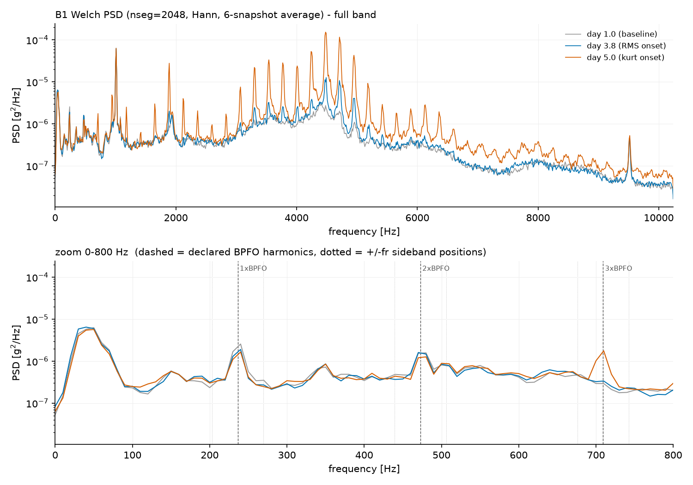

# C2 — 周波数領域: DFT/FFT・リーケージ・Welch PSD

対象コード: `src/lib/spectral.py` / 照合: `src/c2_compare.py` / スペクトル: `src/c2_spectra.py`

## 1. DFT と、その暗黙の仮定

$$
X_k = \sum_{n=0}^{N-1} x_n \, e^{-i 2\pi k n / N}
$$

信号と周波数 $k f_s / N$ の複素正弦波との相関。DFT は**観測窓が無限に周期反復する**
世界を解析しており、信号周波数が $\Delta f = 1/T$ 格子に乗らないと繋ぎ目に不連続が
生じ、それを表現するため全ビンへエネルギーが漏れる(リーケージ)。

**実測(1秒・矩形窓)**: 格子上の 236.0 Hz はピークbinに 100%。格子から 0.4 ずれた
236.4 Hz は**ピークbinに 57.3% しか残らず**、10bin先でも −27.7 dB。
帰結: 線の振幅は 1bin でなく **±数binの積分**で拾う(C4 の実装規則)。

> 記録: 当初エージェントは「236.4 Hz はほぼ漏れない」と誤った前提で出題し、
> 本人が格子計算から違和感を指摘して訂正に至った。**問題文も検証対象**。

## 2. FFT (radix-2)

偶奇分割 $X_k = E_k + W_N^k O_k$。後半ビンの符号は

$$
W_N^{k+N/2} = W_N^k \cdot e^{-i\pi} = -W_N^k
$$

から $X_{k+N/2} = E_k - W_N^k O_k$(本人導出)。各深さ $O(N)$ × 深さ $\log_2 N$ 段
で $O(N \log N)$。手トレース `fft_radix2([1,2,3,4]) = [10, -2+2i, -2, -2-2i]` を
実行と突き合わせ一致。

**観測**: `dft_naive` の丸め(3.4e-13)は FFT(5.7e-16)より3桁大きい。
**演算量の削減は丸め誤差の削減でもある。**

## 3. Welch PSD

ピリオドグラムは各ビンが自由度2のカイ二乗 — **Nを増やしても分散は減らない**
(ビンが増えるだけ)。Welch はセグメント平均で分散を 1/K にし、分解能を差し出す。

**セグメント長の設計(本人計算)**: Hann 主葉 ≈ 4bin、BPFO/BPFI 間隔 60.5 Hz に対し
$N_{seg} \ge 4 f_s / 60.5 = 1354 \to 2048$(2のべき乗へ切り上げ)。 $\Delta f_{seg} = 10$ Hz。

規約(宣言): 片側 density、セグメント毎平均除去、 $U = \mathrm{mean}(w^2)$ 補正、
DC/Nyquist 以外 2 倍、重なり 50%、セグメントFFTは自前 `fft_radix2`。

**照合**: fft_radix2 ↔ numpy 5.7e-16 / hann ↔ scipy 厳密一致 /
welch_psd ↔ scipy ~1e-15(合成・実データとも) / Parseval 0.997〜1.008。
規約を事前宣言した照合は今回罠を踏まなかった。

## 4. B1 スペクトル3時点比較(賭けの決着)

事前の賭け: (Q1)本人「day 3.8 で離散線が既に立っている(B)」— 自身の潤滑仮説(A)と
対立する側に賭けた。(Q2)「BPFO 高調波に ±fr 側帯は立たない」(C0 リグ幾何の宣言)。

**実測(Δf=1Hz)**:

| 証拠 | 値 |
|---|---|
| 広帯域 2–6kHz | day3.8 ×1.3 / day5.0 ×2.5 |
| 櫛(コム)の間隔(day5.0, 3–6.5kHz, 10区間) | **一貫して 236 Hz** |
| day3.8 の櫛の線の成長 | 4492Hz で **×9.6**、4728Hz で ×7.6 |
| ±fr 側帯(day5.0) | **無し**(対床比 1.01 / 0.72) |

- **判定1: 賭けB勝利** — 236Hz間隔の櫛が day3.8 で既に成長。広帯域×1.3 は従属的。
  潤滑仮説は主因としては棄却。
- **判定2: fs = 20.48 kHz 確定** — 櫛間隔 236 Hz はすべり帯 231.7〜236.4 の内側
  (fs=20.00kHz なら 237.3〜242.1 に見えるはず)。**すべり 0.17%**。
  C0 で宣言した離散仮説判別が3ステージ越しに機能した。
- **判定3(側帯): C0 宣言どおり無し** — 外輪固定・荷重域静止の幾何予言が的中。

## 5. 237 Hz の謎 — 測定精度と発生源の教訓2件

**教訓1(bin量子化)**: Welch( $\Delta f$ =10Hz)では線の位置が「ちょうど 240.0 Hz」に
見え、電源系(4×60Hz)説が浮上したが、これは **10Hz格子のbin中心**にすぎなかった。
Δf=1Hz で測り直すと真の位置は **237 Hz**。
**ピーク位置の主張には、その主張に足る Δf が要る。**

**教訓2(発生源の特定)**: 237 Hz 線はベースラインから線/床比 118 で存在し成長しない。
本人が判定表(どの結果ならどの仮説か)を先に書き、4ch 同時録音で強度勾配を測定:

| ch | 線/床比 | 絶対強度 |
|---|---|---|
| ch1 | 27.4 | 7.9e3 |
| ch2 | 42.6 | 2.3e4 |
| **ch3** | **106.3** | **1.1e5(ch1の14倍)** |
| ch4 | 6.7 | 2.5e3 |

→ **B3 起源の伝播ノイズと確定**。C1 で「全期間最も衝撃的だが壊れなかった B3」の
正体の一部がこの BPFO 族の線。さらに:

- **低周波は減衰が小さく遠くまで届く** — ch1 の基本波帯は最初から「B3 の陣地」
- **高周波は減衰が激しく局所に留まる** — だから B1 自身の欠陥は高周波の櫛に最初に現れた
- これが **C3 でエンベロープ解析を高周波共振帯に掛ける根拠**(周波数指紋の分離だけで
  なく、**空間的な選択性**のため)

## 定着チェック(C2)

Q1(コード). `welch_psd` の `p[1:-1] *= 2.0` — なぜ先頭と末尾は2倍しないのか。nseg が奇数だったらこの行はどう壊れるか

(本人が解く)

Q2. 「Nを増やしてもピリオドグラムの分散は減らない」— では同じ x から分散を減らす方法を2つ挙げ、それぞれ何を代償にするか

(本人が解く)

Q3. 今後「ピークは f0 Hz にある」と主張するとき、その主張の誤差棒を決める要素を2つ挙げよ(今日踏んだ罠から)

(本人が解く)

Q4. B1 の櫛は 3〜6.5kHz に出た。もし加速度計が B3 のハウジングに付いていたら、B1 の初期欠陥はどう見えたか。「測定点の選定」という実務判断に翻訳せよ

(本人が解く)

