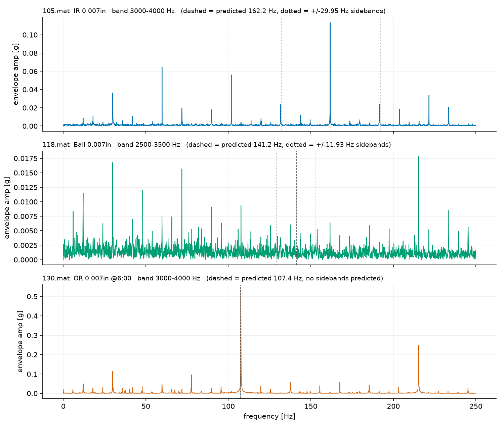

# C3 — エンベロープ解析: 解析信号と known-answer test

対象コード: `src/lib/envelope.py` / 照合: `src/c3_compare.py` / CWRU: `src/c3_cwru.py`

## 1. 信号モデルと復調

欠陥振動は「共振リンギング(搬送波・数kHz) × 衝撃列(包絡線・故障周波数)」の振幅変調。
生スペクトルでは搬送波の周りに $f_d$ 間隔の側帯の櫛として現れる(C2 で実測)。
エンベロープ解析は復調: 包絡線を取り出しそのスペクトルを見れば $f_d$ に単一の線が立つ。

## 2. 解析信号(Hilbert)の FFT 実装

$$
z(t) = x(t) + i\,\hat{x}(t), \qquad \hat{X}(f) = -i\,\mathrm{sgn}(f)\,X(f), \qquad \lvert z \rvert = \text{包絡線}
$$

実装: FFT → 負周波数 0・正周波数 2 倍・DC/Nyquist 1 倍 → 逆FFT。
実部が元信号に厳密に戻ることはエルミート対称性が保証(本人説明)。
手検算 $\cos \to z = e^{i\omega t}$ 、手トレース `analytic([1,0,-1,0]) = [1, i, -1, -i]`,
$\lvert z \rvert = 1$ を実行と突き合わせ一致。

照合: scipy.signal.hilbert と **~5e-16**(偶数N・奇数N・実データ)。
帯域通過は FFT マスク(零位相 brick-wall) — 時間領域では sinc との畳み込みで、
端に Gibbs リンギング(周期境界)を持つ宣言済みトレードオフ。

合成 known-answer: 3kHz 搬送波 × 107.4Hz パルス列 → エンベロープスペクトルに
線/床 **431**。同じ信号の生スペクトルの 107.4Hz は **1.32(床)** — 情報は包絡線にいる。

## 3. CWRU known-answer test

手続き(エンベロープを見る前に確定): 帯域 = 欠陥PSD/正常PSD 比が最大の 1kHz 窓。
賭けシート(本人が事前宣言): 105 内輪 → 162.2Hz ± fr / 118 玉 → 141.2Hz ± FTF(11.93) /
130 外輪 → 107.4Hz・側帯なし。

| ファイル | 帯域 | 主線: 予測→実測 | 線/床 | 側帯 |
|---|---|---|---|---|
| 105 内輪 | 3–4kHz | 162.2 → **161.70 (−0.31%)** | 18.9 | ±fr **あり**(6.8/6.4) |
| 118 玉 | 2.5–3.5kHz | 141.2 → (床レベル) | **1.5** | なし |
| 130 外輪 | 3–4kHz | 107.4 → **107.61 (+0.20%)** | **105.3** | ±fr 弱(13.8/16.4) |

### 判定1(内輪) — 勝ち、物理が閉じた

内輪の傷は軸と共に回り荷重域を毎回転通過 → 振幅変調 → ±fr 側帯。
C0 の幾何モデルが known-answer で完結。

### 判定2(玉) — 賭けは外れ。原因切り分け実験を本人が設計し「データ側」と確定

判定表を先に宣言(a=手法/帯域の問題なら別帯域で線が浮上、b=データの問題なら
全帯域で尖度≈3・線なし)し、**尖度×帯域グリッド探索**(500Hz〜Nyquist、
BSF族 11.9/70.6/141.2/282.4Hz をマッピング)を実行:

- 生波形尖度 **2.98 ≒ ガウス**、全10帯域の帯域内尖度 2.6〜3.2
- BSF族の線は**全帯域で床レベル**(最大 7.1)

→ **(b) 確定: ラベル「玉欠陥」に対し振動シグネチャが存在しない。**
文献整合: Smith & Randall (2015, MSSP 64–65, 100–131) — CWRU には診断不能記録が
含まれ、指定欠陥の古典的特徴を示す記録は比較的少ない。
**教訓(本人の言葉)**: 欠陥ラベルの存在は欠陥シグネチャ励起の十分条件ではない。
ベンチマークでもラベルを無条件に Ground Truth と過信せず、衝撃性とスペクトル構造で
励起状態を事前検証する。

### 判定3(外輪) — 側帯は二値でなく連続量

側帯/主線: 内輪 36% → CWRU外輪 14% → IMS外輪 ~0%。
**言い直した規則(本人)**: 外輪欠陥の ±fr 側帯の相対強度は、「欠陥位置に掛かる全荷重に
占める回転同期の動的荷重成分(偏心・不釣り合い)の比率」に比例する連続量。
IMS は 6000lbs バネの静荷重支配 → ~0%。小型リグは動荷重の寄与が相対的に大きい → 14%。

## 定着チェック(C3)

Q1(コード). `envelope_spectrum` は包絡線の平均を除去してから rfft する。除去しないと何がスペクトルを支配し、線の読み取りにどう干渉するか

(本人が解く)

Q2. 合成テストで生スペクトルに 107.4Hz の線は立たなかった。ではこの信号の「107.4Hz の情報」は生スペクトルのどこに・どんな形で存在していたか(C2 の実測と接続)

(本人が解く)

Q3. 線/床比の「床」の物理的正体は何か — 帯域通過したガウスノイズの包絡線はどんなスペクトルを持つか

(本人が解く)

Q4. 帯域選定を人手でなく宣言済み手続き(PSD比最大)にした理由を「自由度」の言葉で。実務で Kurtogram 等の自動帯域選定を使うときの注意を1つ

(本人が解く)

