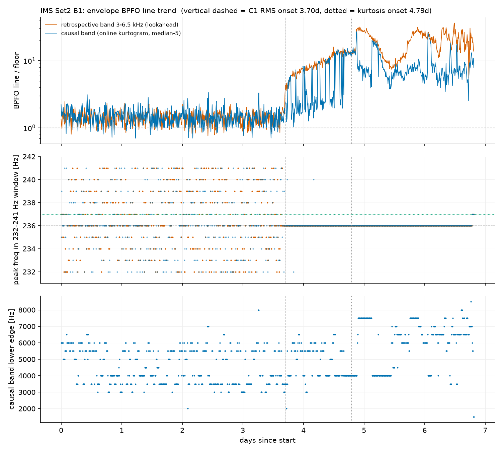

# C4 — IMS run-to-failure への適用: エンベロープ BPFO 線トレンド

対象コード: `src/c4_trend.py` / キャッシュ: `data/c4_set2_envtrend.npz`

## 1. 設計

- **主指標**: エンベロープスペクトルの BPFO 線/床比(線 = 236Hz±2% 窓のピーク±1bin積分、
  床 = 50–500Hz 中央値ベース)。無次元・ゲインドリフトに頑健・故障モード特異的。
- **検出器の因果性**(本ステージの新概念): 帯域 3–6.5kHz は day5 の櫛を見て特定した
  ものであり、これで「day X に検出できた」と主張すると **lookahead bias**
  (トレードのバックテストにおける未来参照・サンプル内過剰適合と同型 — 本人の翻訳)。
  対策として2本立て:
  - **回顧帯域**(3–6.5kHz 固定): 性能上限。lookahead ありと明記して報告。
  - **因果帯域**: 各時点までの情報のみ — 帯域内尖度最大の 1kHz 窓(オンライン
    Kurtogram、本人の C3 設計)を直近5点の中央値で平滑化(breakdown point 50% で
    単発ノイズを遮断 — 本人説明)。
- 除外: rms < 0.01 g(C1 床規則)。立ち上がり判定は C1 と同一(0–3日 +5σ 3点連続)。

## 2. 実測結果

| 検出器 | ベースライン CV | 立ち上がり |
|---|---|---|
| RMS(C1) | 1.4% | 3.701 日 |
| **エンベロープ回顧** | 21% | **3.694 日** |
| エンベロープ因果 | 27% | 3.743 日 |
| 尖度(C1) | 2.8% | 4.792 日 |

### 判定1: 賭け(「3.70日より早い、2.8〜3.5日圏」)は外れ — 事実上の同着

S/N 集約(コヒーレント積分)の理屈は定性的に正しいが、**分子の物理的ゲインを
分母 σ の高 CV が相殺した**(本人の言語化)。線/床比のベースラインはレイリー床の
比なので CV 21% — RMS の異常に静かなベースライン(CV 1.4%)に勝てない。
**C1 の教訓「感度 = 物理 × ベースラインの静けさ」の再演。**

### 判定2: 予測した「237Hz の壁」は現れなかった — 加算と変調の区別

ベースライン線/床比は 1.41 ≒ 床。B3 の 237Hz は生スペクトルでは線/床 118 の巨大な
線だが、**低周波領域の加算的な正弦波**であって「3–6.5kHz 帯の振幅変調」ではない
(本人の言語化)。帯域通過が加算成分を除去し、包絡線は帯域**内**の変調しか見ない。
→ エンベロープの伏兵(B3 同居)は不発。予測は機構レベルで外れ、外れ方が
「加算 vs 変調」の理解を確定させた。

### 判定3(予期しない発見): 周波数ロック

窓内ピーク位置が、ベースライン期は 232–241Hz に**散らばり**、3.69 日を境に
**236Hz へ完全ロック**(4.5–6.5日で 288 点中 287 点)。床のピーク位置は
レイリー変動でほぼ一様に散る(偶然の一致率 ~1/10)のに対し、真の線は動かない。
→ 本人が **FLI(Frequency Locking Index)** = 局所ピーク周波数の時間的散逸度を
第3の検出器として提案。C5 で線/床比・時間領域指標と並べて評価する。

## 3. C5 へ引き継ぐ設計

- 検出器: RMS / 尖度 / エンベロープ線床比(回顧・因果) / FLI。
- 評価: ①周波数指紋×ラベル整合(236 ロックが直接証拠) ②検出の故障先行
  ③初期健全区間の誤報率。lookahead の有無を検出器ごとに明記。
- リードタイムは間欠観測(10分毎1秒)ぶん保守的(C1 Q4)。

## 定着チェック(C4)

Q1(コード). compute() は機械停止スナップショットに NaN を書き、onset 判定は np.isfinite でマスクする。もし NaN のまま平均・σ を計算したら何が起きるか

(本人が解く)

Q2. 因果帯域の線/床比は day 4〜5 に下向きのスパイク(ドロップアウト)を繰り返す。原因は何で、実運用では何という問題(警報の挙動)になるか。緩和策を1つ

(本人が解く)

Q3. FLI が線/床比より「偶然に強い」ことを定量で: 床だけの窓(10 binに一様散布)で、ピークが3点連続して同じ±1Hzに入る確率はおよそいくらか

(本人が解く)

Q4. RMS と同着だったのに、実プラントではエンベロープ検出器を推す理由を2つ — このリグの RMS CV 1.4% という条件が現場で成立しにくい理由と、検出後の「次のアクション」の観点から

(本人が解く)

