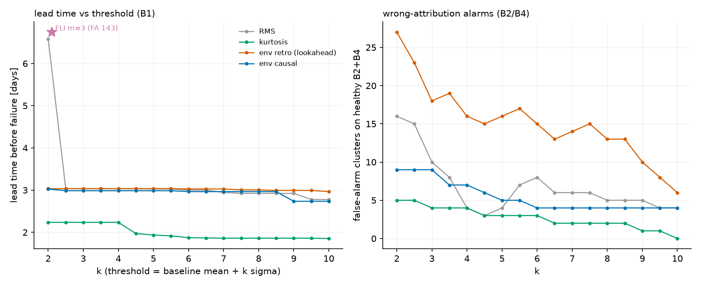

# C5 — しきい値設計と評価: 交換レート・多重比較・帰属

対象コード: `src/c5_eval.py` / 検証: 本文の再設計検証(2026-07-27)

## 1. 評価の枠組み

劣化開始の正解が無い(C0)ため、評価は3本柱: ①周波数指紋×ラベル整合(C4 の 236Hz
ロックが直接証拠) ②検出が故障に先行 ③健全と宣言できるデータでの誤報率。
Set2 の壊れなかった B2/B4 (6.8日分) を誤報測定に使う — ただし終盤は B1 からの
伝播があるため、これは同時に**帰属誤り(wrong attribution)の試験**になる。

- **評価基準時刻**: rms > 5×ベースライン中央値の最初 = **6.743日**。
  (当初宣言は 10× だったが実データ最大 0.725g が届かず不成立 → 5× に**開示付き改訂**。
  これは実故障時刻ではなく事後定義の評価基準であり、「リードタイム」は
  この基準時刻までの時間を意味する。)
- **検出時刻の定義(2026-07-27 レビューで修正)**: 3点連続超過の**3点目(警報確定)**を
  検出時刻とする。系列が閾値を超え始める時刻より2スナップショット(約20分)遅い保守的な定義。
- **しきい値は交換レート**: k はリードタイムと誤報率を交換する。1点の検出時刻報告は
  バックテストの1勝報告と同じで無意味 — 曲線(パラメータ感度)が誠実な成果物(本人の翻訳)。
- lookahead は検出器ごとに明記(回顧帯域=あり)。リードタイムは間欠観測(10分毎1秒)
  ぶん保守的(C1 Q4)。

## 2. 実測(kσ 掃引・k=5 抜粋)

| 検出器 | lookahead | リードタイム | B2+B4 誤報(早期<4.5d / 後期) |
|---|---|---|---|
| RMS | なし | 3.03日 | 4 (0 / 4) |
| 尖度 | なし | 1.94日 | 3 (0 / 3) |
| env 線/床(回顧) | **あり** | 3.03日 | 16 (0 / 16) |
| env 線/床(因果) | なし | 2.99日 | **5 (0 / 5)** |
| FLI 単独 m=3 | あり | (day 0.00 で偶然発報) | **143 (129 / 14)** |

注: 因果版の誤報は当初、回顧帯域で計算した B2/B4 系列を流用しており 16 件と報告して
いたが、レビュー指摘を受け因果帯域の系列を各chで独立計算し直した結果 **5 件**。

### kσ の較正(歪んだベースラインでの読み違え)

P(x > μ+3σ) の実測: RMS 0.0000 / 尖度 0.0023 / env 0.0069〜0.0139 vs ガウス想定 0.0014。
env 系は**5〜10倍**の誤報予算読み違え。推奨(本人判定): RMS・尖度 = kσ、
env 線/床 = 分位点またはレイリー/ワイブル適合。ただし n=430 の 99.9% 分位点は
最大値の外側への外挿で、単一極値に過剰適合する(本人の1文)。

## 3. FLI の失敗と2つの再設計(本人設計・検証済み)

**失敗の解剖**: FLI 単独 m=3 は B2/B4 で 143 件(うち早期129件)、B1 ですら day 0.00 で
偶然発報。原因は**多重比較**。なお偶然ロック確率の見積りは、本人の 2.7〜9% は
「固定3bin窓」モデルの値で、実装の定義(任意位置・3点の max−min≤2bin)では一様床モデルで
**160/1000 = 16%**(レビュー指摘で訂正)。いずれにせよ試行の反復で偽発見が常態化する
構図は同じで、実測 129 クラスタと整合する(窓の重なりがあるため確率×試行数との比較は
オーダーの一致に留まる)。

**再設計と検証結果**:

| 検出器 | 早期誤報 | 後期誤報 | B1 検出 |
|---|---|---|---|
| FLI 単独(元) | 129 | 14 | day 0.00(偶然) |
| **FLI-v2**(236±1binアンカー + 線/床ゲートAND) | **0** | 54 (28+26) | 確定 3.694日 |
| env 線/床(元) | 0 | 16 | 確定 3.708日 |
| **env + max-channel 帰属規則(全4ch)** | 0 | **0** | 確定 3.708日(規則で不変) |
| 合成 v1(単点ゲート&max、ロック持続のみ) | 0 | 4 (1+3) | 確定 3.694日 |
| **合成 v2(条件全体に3点確定)** | 0 | **0** | 確定 3.708日 |

実装: `src/c5_eval.py` の `redesign_report()`(再現可能)。いずれも回顧帯域(lookahead
あり)の系列で評価。比較スタックは全4ch(ch3 の回顧系列を追加計算)。誤報統計の対象は
B2/B4 — B3 は壊れていないが健全期から別の異常シグネチャを持つ個体のため統計から
除外(C1/C2 に記録)、と開示する。

**合成の教訓(2026-07-27 追補)**: 当初は「両層を重ねれば 0/0」と**測らずに主張していた**
(本人指摘)。実測すると合成は自明ではない — 持続条件(3点確定)を合成条件の**どこに**
掛けるかで結果が変わり、単点ゲートの合成(v1)では後期4クラスタが残った。条件全体に
3点確定を掛けた v2 で 0/0 となるが、**v2 は v1 の漏れを観測した後に定義した**ため、
この選択自体が調整された自由度であることを開示する。

- **FLI-v2**: アンカー=同時検定する仮説数(ファミリーサイズ)を10→1に減らす操作。
  Bonferroni(閾値を α/m に切り詰める調整)と同じ問題意識だが、こちらはドメイン知識で
  無関係な仮説を事前排除する**検定空間の直接削減**(本人の対比)。ゲート=振幅の裏付け要求。
  多重比較の病気を完治(129→0)。ただし後期はむしろ増加(54件) — 伝播してきた
  B1 の 236Hz 線は B2 から見ても「本物の・周波数が正しい・ロックする線」であり、
  **FLI は周波数の同一性を検査するが発生源の位置を検査しない**(本人の言語化)。
- **max-channel 規則**: 発報条件に「自チャネルが比較チャネル中最大」を追加。
  本 run では発生源 B1 の線/床比が常に最大であり、帰属誤りを抑制できた(16→0)。
  センサ感度差・伝達経路・同時故障ではこの前提が崩れる(本人の Q3 設計)ため、
  チャンネル間校正が前提。B1 の検出は確定 3.708日のまま不変。
- **2層防御**(本人の整理): 第1層 FLI-v2 = 単一センサ内で「本物の 236Hz 周期衝撃」を
  証明(偶然を遮断)。第2層 max-channel = センサ間比較で「自機由来か貰い事故か」を
  特定(伝播を遮断)。直交する2つの病気に直交する2つの薬。

## 定着チェック(C5)

Q1(コード). detect_day は当初「3点連続の最初の点」の day を返していた(本人指摘で警報確定=3点目に修正済み)。警報が確定するのは3点目である。リードタイム報告にどちらを使うのが保守的か、20分の差は本件の結論に効くか

(本人が解く)

Q2. FLI-v2 のアンカーを統計的検定の言葉で言うと、何を 10 から 1 に減らした操作か。Bonferroni 補正との関係は

(本人が解く)

Q3. max-channel 規則が誤動作する状況を1つ設計し、対策を述べよ(例: 2軸受同時故障、センサゲイン不均一、発生源センサの故障)

(本人が解く)

Q4. 顧客報告で「リードタイム3.03日」に必ず添えるべき但し書きを2つ

(本人が解く)

